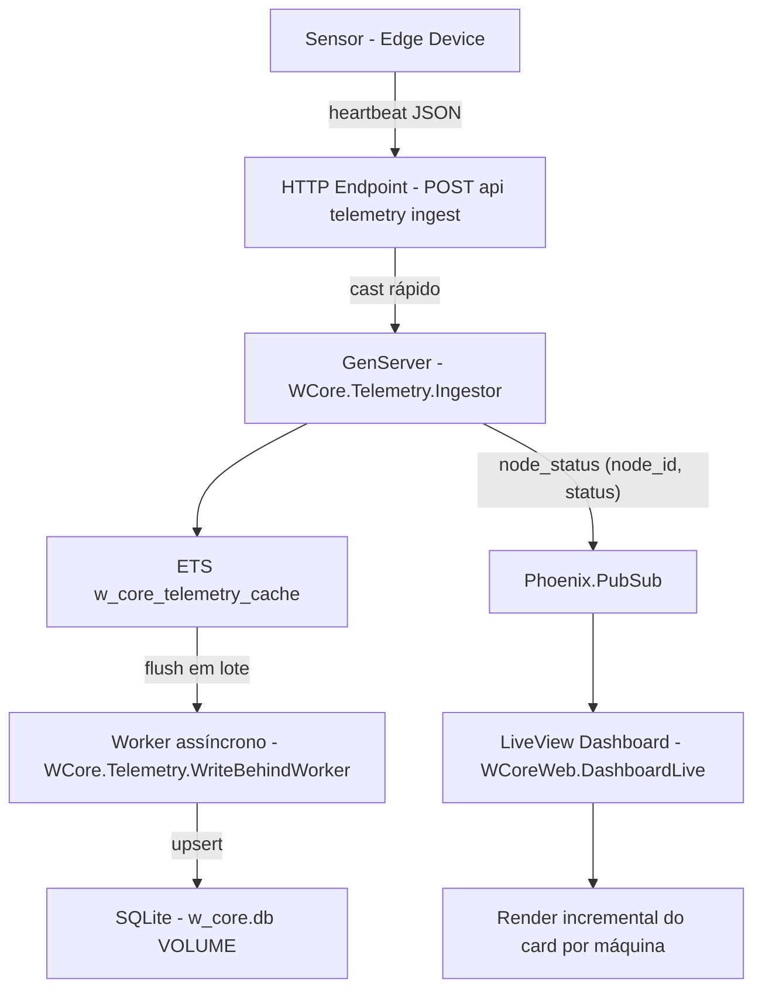

# WCore - Motor de Estado em Tempo Real (BEAM/Elixir + Phoenix LiveView)

Motor de estado mission-critical para plantas industriais: recebe heartbeats de milhares de sensores com baixa latência, atualiza o dashboard em tempo real via ETS/OTP e persiste de forma eventual em SQLite (write-behind + upsert).

**Recursos:** ingestão fire-and-forget; ETS quente com `:set` e atualização por `:ets.update_counter/4`; write-behind assíncrono com `Repo.insert_all/3`; upsert via `unique_index`; dashboard LiveView com PubSub incremental; autenticação gerada por `phx.gen.auth`; Docker multi-stage + Elixir release.

---

## Onde estão os detalhes completos

Este `README.md` traz uma visão consolidada do projeto. A explicação detalhada de arquitetura, código, decisões e trade-offs está nos documentos de evolução abaixo:

- `drafts/step-1-foundation.md`: fundação do projeto (auth com `phx.gen.auth`, modelagem Ecto e índices únicos para consistência).
- `drafts/step-2-otp-ets.md`: pipeline OTP/ETS de baixa latência (ingestão quente, contador cumulativo e write-behind para SQLite).
- `drafts/step-3-liveview-ds.md`: dashboard em tempo real com LiveView, PubSub incremental e componentes HEEx semânticos.
- `drafts/step-4-tests.md`: estratégia de testes de carga, concorrência, resiliência e consistência eventual.
- `drafts/step-5-infra-arch.md`: empacotamento e operação com Docker + release, variáveis de runtime e persistência em volume.

---

## Arquitetura do sistema



---

## Estrutura do projeto

```
./
├── Dockerfile
├── rel/
│   └── env.sh.eex
├── drafts/
│   ├── step-1-foundation.md
│   ├── step-2-otp-ets.md
│   ├── step-3-liveview-ds.md
│   ├── step-4-tests.md
│   └── step-5-infra-arch.md
├── lib/
│   ├── w_core/
│   │   ├── application.ex
│   │   └── telemetry/
│   │       ├── ingestor.ex
│   │       └── write_behind_worker.ex
│   └── w_core_web/
│       ├── controllers/
│       │   └── telemetry_ingest_controller.ex
│       ├── live/
│       │   └── dashboard_live.ex
│       └── components/
│           └── industrial_components.ex
└── priv/
    └── repo/
        └── migrations/
```

---

## Endpoints

| Método | Rota | Quem usa | Auth |
|-------|------|-----------|------|
| `POST` | `/api/telemetry/ingest` | Sensor/Edge Device | não (ingestão) |
| `GET` | `/dashboard` | Operador da planta | sim (sessão gerada em `phx.gen.auth`) |

---

## Como enviar um heartbeat (simulação de sensor)

Antes de enviar telemetria, o `node_id` precisa existir em `nodes` (tabela de sensores/máquinas).

Exemplo (payload mínimo):

```bash
curl -X POST "http://localhost:4000/api/telemetry/ingest" \
  -H "content-type: application/json" \
  -d '{
    "node_id": 1,
    "status": "ok",
    "payload": {},
    "timestamp": "2026-03-25T14:00:00Z"
  }'
```

Observações:
- `timestamp` é opcional; se vier, o sistema normaliza para `:utc_datetime` sem microsegundos.
- a ingestão é fire-and-forget (resposta `202 Accepted`), e a persistência no SQLite ocorre em lote.

---

## O que cada módulo faz

### `lib/w_core/application.ex`
Cria a ETS no boot (`:w_core_telemetry_cache`) e registra os processos do pipeline:
- `WCore.Telemetry.Ingestor`
- `WCore.Telemetry.WriteBehindWorker`

Explicação detalhada:
- este módulo é o "ponto de montagem" da aplicação OTP; tudo que precisa viver continuamente vai para a árvore de supervisão.
- criar a ETS aqui (e não dentro do `Ingestor`) garante que o estado quente sobreviva ao restart de um worker individual.
- se `Ingestor` cair, o supervisor reinicia apenas ele; a tabela ETS continua acessível para leitura/escrita.

### `lib/w_core/telemetry/ingestor.ex`
Hot-path de ingestão:
- valida o formato do evento
- atualiza o contador em ETS com `:ets.update_counter/4`
- atualiza campos quentes (status + último payload) com `:ets.insert/2`
- publica apenas `{:node_status, node_id, status}` no PubSub

Explicação detalhada:
- `ingest/1` usa `GenServer.cast/2` para não bloquear o caller HTTP; por isso a API responde rápido mesmo sob pico.
- `:ets.update_counter/4` evita race de contador, porque incrementa no próprio ETS de forma eficiente.
- a decisão de publicar só `node_id + status` no PubSub reduz tráfego interno e evita render desnecessário no LiveView.
- timestamp é normalizado para segundos para manter compatibilidade com `:utc_datetime` no SQLite.

### `lib/w_core/telemetry/write_behind_worker.ex`
Persistência eventual:
- a cada ~5s, faz `:ets.tab2list/1`
- projeta em linhas compatíveis com `node_metrics`
- faz upsert em lote com `Repo.insert_all/3` usando `conflict_target: [:node_id]`

Explicação detalhada:
- esse processo desacopla escrita de disco do caminho crítico de ingestão.
- em vez de 1 write por evento, ele consolida o estado e grava em lote; isso reduz lock contention no SQLite.
- `insert_all + on_conflict` implementa idempotência: a mesma máquina sempre converge para "último estado conhecido".
- antes de persistir, filtra apenas `node_id` existentes em `nodes`, evitando violação de chave estrangeira.

### `lib/w_core_web/controllers/telemetry_ingest_controller.ex`
Endpoint HTTP para simular sensores enviando JSON.
Converte payload/`timestamp` para `DateTime` e chama `WCore.Telemetry.Ingestor.ingest/1`.

Explicação detalhada:
- essa controller é uma "borda" de entrada: valida/parsa dados externos para o formato interno do domínio.
- em sucesso retorna `202 Accepted`, indicando processamento assíncrono (não garante persistência imediata no DB).
- em payload inválido retorna `400 Bad Request`, protegendo a camada de ingestão de dados malformados.

### `lib/w_core_web/live/dashboard_live.ex` + `industrial_components.ex`
Dashboard em tempo real:
- `mount/3` carrega snapshot inicial da ETS
- `handle_info/2` reage ao PubSub e atualiza apenas o card da máquina afetada
- componentes HEEx mantêm o design sem dependências pesadas

Explicação detalhada:
- no `mount/3`, a tela nasce com o estado mais recente em memória, sem depender de consulta no SQLite.
- no `handle_info/2`, o update é granular por `node_id`, reduzindo custo de diff/render do LiveView.
- `machine_card/1` centraliza markup e regras visuais por status, evitando duplicação de HTML na página.
- a rota é protegida por autenticação; sem sessão válida, o acesso é redirecionado para login.

---

## Como rodar (dev)

```bash
source ~/.asdf/asdf.sh
mix deps.get
mix ecto.migrate
mix phx.server
```

Acesse:
- `http://localhost:4000/dashboard` (login primeiro)

---

## Como rodar com Docker (serviço único)

### Pré-requisitos

- Docker + Docker Compose instalados (`docker` e `docker compose`)
- Porta `4000` livre (ou ajuste o mapeamento no compose)

### 1) Subir o projeto (um único comando)

Na raiz do projeto:

```bash
docker compose up --build
```

Esse comando sobe dois serviços no mesmo compose:
- `w_core`: aplicação principal (Phoenix release)
- `w_core_loadgen`: simulador de sensores que envia heartbeats continuamente

Assim o dashboard já recebe eventos automaticamente, sem scripts extras.
O SQLite fica persistido no volume Docker (`/data/w_core.db`).

### Checklist rápido do avaliador (fluxo ponta a ponta)

1. Subir o projeto com `docker compose up --build`.
2. Abrir `http://localhost:4000/users/register` e criar uma conta.
3. Abrir `http://localhost:4000/dev/mailbox` e localizar o e-mail de confirmação.
4. Clicar no link completo de confirmação (deve abrir em `http://localhost:4000/...`).
5. Fazer login em `http://localhost:4000/users/log-in`.
6. Entrar em `http://localhost:4000/dashboard` e observar atualização em tempo real.

### 2) Abrir as páginas no navegador (URLs completas)

Com o container rodando, abra:

- Registro: `http://localhost:4000/users/register`
- Login: `http://localhost:4000/users/log-in`
- Dashboard (requer login): `http://localhost:4000/dashboard`
- Mailbox para confirmação de conta: `http://localhost:4000/dev/mailbox`

Fluxo esperado:
- Se você acessar `/dashboard` sem estar autenticado, você será redirecionado para `/users/log-in`.

### 3) Criar conta + confirmar e-mail (sem SMTP externo)

1. Acesse `http://localhost:4000/users/register`
2. Preencha **Email** e **Password**
3. Envie o formulário
4. Abra `http://localhost:4000/dev/mailbox`
5. Localize o e-mail "Confirmation instructions"
6. Clique no link de confirmação completo

Depois da confirmação, a conta está pronta para login.

Detalhes importantes desse fluxo:
- o sistema usa `phx.gen.auth` com token assinado e expiração;
- em execução local Docker, a entrega de e-mail usa mailbox interno (`/dev/mailbox`);
- sem confirmação, o login por senha pode não liberar acesso total dependendo do estado da conta.

### 4) Fazer login e acessar o dashboard

1. Acesse `http://localhost:4000/users/log-in`
2. Use o mesmo **Email** e **Password** do registro
3. Envie o formulário

Você será redirecionado e conseguirá acessar o dashboard.

### 5) Verificando carga em tempo real no dashboard

Com o `w_core_loadgen` ativo, o dashboard deve começar a mostrar máquinas em poucos segundos.

- URL: `http://localhost:4000/dashboard`
- Comportamento esperado:
  - cards de máquinas aparecem automaticamente;
  - status alterna entre `ok`, `warning` e `critical`;
  - contadores aumentam continuamente.

Para pausar somente a carga:

```bash
docker compose stop w_core_loadgen
```

Para retomar a carga:

```bash
docker compose start w_core_loadgen
```

### 6) Teste rápido de rotas (smoke test)

Este projeto inclui um script que:
- builda a imagem
- sobe um container numa **porta livre** automaticamente
- valida `GET /users/log-in`, `GET /users/register`
- valida que `GET /dashboard` (sem login) redireciona para `/users/log-in`

```bash
./scripts/docker_smoke_test.sh
```

Observação importante:
- Se você estiver com `docker compose up` rodando na porta `4000`, o smoke test **não conflita**, porque ele escolhe uma porta aleatória livre.

### 7) Configuração de `SECRET_KEY_BASE`

O `SECRET_KEY_BASE` precisa ter **pelo menos 64 bytes**, senão o Plug/Phoenix retorna erro ao tentar usar sessão/cookies.

No `docker-compose.yml` já existe um fallback seguro, mas para algo mais “prod”, você pode setar via variável:

```bash
export SECRET_KEY_BASE="$(python3 -c 'import secrets; print(secrets.token_urlsafe(64))')"
docker compose up --build
```

---

## Troubleshooting rápido

### Não chega e-mail de confirmação

- Em Docker local, o e-mail não vai para caixa real; abra `http://localhost:4000/dev/mailbox`.
- Se `/dev/mailbox` não abrir, confirme que `ENABLE_MAILBOX=true` está no `docker-compose.yml`.

### Link abre em host/porta errados

- O link deve apontar para `http://localhost:4000`.
- Se necessário, ajuste variáveis de runtime: `PHX_HOST`, `PHX_SCHEME`, `PHX_URL_PORT`.

### Dashboard sem dados

- Verifique se o serviço `w_core_loadgen` está ativo:
  - `docker compose ps`
- Se estiver parado:
  - `docker compose start w_core_loadgen`

---

## Deploy no Edge (release + Docker)

No runtime do container:
- `DATABASE_PATH=/data/w_core.db` aponta para um arquivo em `VOLUME` (preserva histórico)
- o release roda com `PHX_SERVER=true`

Arquivos relevantes:
- `Dockerfile`
- `rel/env.sh.eex`

