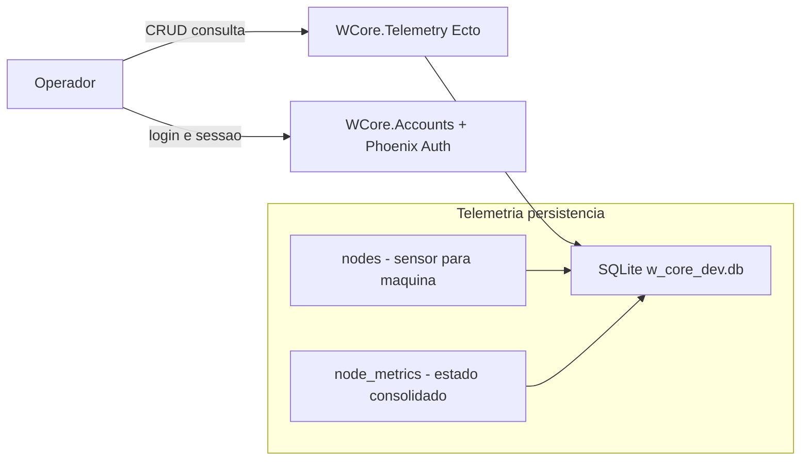

# Step 1 - Foundation (Security Perimeter + Telemetry Ecto Model)

Base do sistema: autenticação do operador + modelagem Ecto do domínio `Telemetry` em SQLite (com índices necessários para upsert eficiente).

**Recursos:** `phx.gen.auth` (perímetro de segurança); contextos Ecto `WCore.Telemetry`; tabelas `nodes` e `node_metrics`; `unique_index` para permitir upsert determinístico no write-behind.

---

## Arquitetura do sistema

---

## O que foi implementado

1. **Autenticação (Perímetro de Segurança)**
   - Gereei `mix phx.gen.auth Accounts User users`.
   - Isso criou o contexto `WCore.Accounts`, schemas de `User` e tabelas auxiliares (tokens, etc.), além das rotas e plugs necessários para proteger páginas do painel.

2. **Modelagem Ecto do contexto `Telemetry`**
   - Gereei:
     - `nodes` via `mix phx.gen.context Telemetry Node ...`
     - `node_metrics` via `mix phx.gen.context Telemetry NodeMetric ...`
   - Ajustei as migrações para as invariantes do motor:
     - `nodes.machine_identifier` com `unique_index` (resolução determinística “sensor -> máquina”)
     - `node_metrics.node_id` com `unique_index` (conflito resolvível por sensor para `upsert` no write-behind)

3. **Base preparada para os próximos passos**
   - Definição explícita de fronteiras:
     - `Accounts`: segurança e sessão do operador
     - `Telemetry`: domínio operacional de sensores e estado
   - Essa separação permite evoluir ingestão/tempo real sem tocar no fluxo de autenticação.

---

## O que mudou na arquitetura

Este passo prepara a divisão em camadas exigida pelo desafio:

1. **Camada de persistência (verdade de longo prazo)**
   - `WCore.Repo` + SQLite armazenam:
     - cadastro estático de máquinas (`nodes`)
     - último estado consolidado (`node_metrics`)

2. **Separação de domínios**
   - `Telemetry` ficou isolado em `WCore.Telemetry`, reduzindo acoplamento com a lógica de autenticação e deixando clara a transição futura para `ETS + OTP` (Passo 2).

---

## Por que isolei o contexto `Telemetry`

- **CQRS/Separation of Concerns**: a persistência será retaguarda (write-behind), enquanto o “lado quente” será movido para ETS depois.
- **Evolução incremental**: no Passo 2, as mudanças ficam concentradas nos processos/ETS, sem reescrever a modelagem do domínio.
- **Testabilidade**: índices e chaves de conflito (base para upsert) ficam governados por um contexto coeso.

---

## Por que SQLite (Edge) com `ecto_sqlite3`

- **Operação simples**: o DB é um arquivo único.
- **Persistência local previsível**: o histórico sobrevive a reinícios quando apontado para volume no container (Passo 5).
- **Lock evitado indiretamente**: o gargalo clássico do DB por escrita síncrona será mitigado no Passo 2 com ETS + write-behind.
- **Restrições do desafio**: sem Postgres/Redis (proibidos).

---

## Por que os `unique_index` importam

O write-behind do Passo 2 precisa atualizar uma linha por sensor sem duplicar registros.
Para isso, o SQLite deve conseguir resolver conflitos determinísticos:

- `nodes.machine_identifier` com `unique_index`: garante que um “sensor físico” mapeie para a mesma máquina.
- `node_metrics.node_id` com `unique_index`: permite `upsert`/`insert_all` com `conflict_target: [:node_id]` durante flush.

Sem esses índices, o write-behind teria que fazer “lookup + update” (custo maior) ou acabaria gerando duplicidades.

---

## Arquivos principais

| Arquivo | Papel |
|--------|-------|
| `lib/w_core/telemetry.ex` | Contexto `Telemetry` (consulta/CRUD Ecto) |
| `lib/w_core/telemetry/node.ex` | Schema Ecto de `nodes` |
| `lib/w_core/telemetry/node_metric.ex` | Schema Ecto de `node_metrics` |
| `priv/repo/migrations/*create_nodes*.exs` | `unique_index` em `machine_identifier` |
| `priv/repo/migrations/*create_node_metrics*.exs` | `unique_index` em `node_id` |

---

## Explicação detalhada do código (Step 1)

### `lib/w_core/telemetry.ex`
- É a API de domínio da telemetria para o restante da aplicação.
- Encapsula queries/CRUD, evitando que controller/liveview acessem `Repo` diretamente.
- Isso reduz acoplamento e facilita testes, porque a regra de acesso aos dados fica centralizada.

### `lib/w_core/telemetry/node.ex`
- Modela o cadastro estático da máquina/sensor.
- O `machine_identifier` único impede duplicidade semântica (mesmo equipamento cadastrado duas vezes).
- Serve como referência para relacionamento de métricas (`node_metrics.node_id`).

### `lib/w_core/telemetry/node_metric.ex`
- Representa o estado consolidado mais recente por máquina.
- Não é tabela de eventos históricos; é tabela de "último estado conhecido", ideal para leitura rápida de dashboard.
- A chave única por `node_id` prepara o terreno para `upsert` no write-behind.

### Migrações (`priv/repo/migrations/...`)
- Definem estrutura e invariantes no próprio banco.
- `unique_index` move garantia de consistência para a camada mais confiável (DB), evitando depender só de validação em código.
- Em sistema concorrente, essa proteção no DB é essencial para evitar condições de corrida em gravações.

---

## Como esta fundação funciona em runtime

- Requisições web entram pelo `Router`, passam pelos plugs de sessão/csrf e chegam aos controllers/liveviews.
- O contexto `Accounts` protege o perímetro de autenticação e autorização de páginas sensíveis.
- O contexto `Telemetry` concentra operações de domínio e prepara a transição para o pipeline transacional em memória.
- O SQLite opera como base durável, enquanto as regras de domínio permanecem na camada Elixir (contextos).

---

## Possíveis melhorias e adaptações

- **Histórico de eventos**: adicionar tabela de eventos brutos para auditoria temporal completa.
- **RBAC**: estender `Accounts` para papéis (operador, supervisor, admin) com políticas por rota/ação.
- **Validações de domínio**: reforçar constraints de negócio (faixas de métricas, estado permitido por tipo de máquina).
- **Multi-planta**: adicionar `plant_id` em `nodes` para isolamento lógico por unidade industrial.
- **Migrações evolutivas**: estratégia de versionamento de schema sem downtime para edge clusters.

