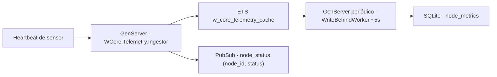

# Step 2 - OTP & ETS (Write-Behind para SQLite)

Hot-path em memória com ETS e ingestão via GenServer, evitando lock do SQLite por evento. Persistência eventual com write-behind e upsert por lote.

**Recursos:** ETS quente (`:w_core_telemetry_cache`); `:ets.update_counter/4`; write-behind assíncrono; upsert via `unique_index(:node_id)`; PubSub incremental (ID + status).

---

## Arquitetura do sistema

---

## O que foi implementado

1. **ETS como camada quente**
   - Criada no boot em `WCore.Application`.
   - Configuração:
     - tipo `:set` (acesso por chave)
     - `:public` + `:named_table`
     - `read_concurrency: true`
   - Layout de tupla:
     - `{node_id, status, event_count, last_payload, timestamp}`

2. **`WCore.Telemetry.Ingestor` (GenServer)**
   - Atualiza ETS no hot-path:
     - `:ets.update_counter/4` para incrementar `event_count`
     - `:ets.insert/2` para status + último payload + timestamp
   - Evita payload grande no PubSub:
     - publica apenas `{:node_status, node_id, status}`

3. **Write-Behind (`WCore.Telemetry.WriteBehindWorker`)**
   - A cada ~5s:
     - faz snapshot com `:ets.tab2list/1`
     - projeta para linhas da tabela `node_metrics`
     - persiste com `Repo.insert_all/3` usando `conflict_target: [:node_id]`

---

## Por que `:set` e não `:ordered_set`?

- Atualizações e leituras são por chave (`node_id`), não por ordenação.
- `:ordered_set` adiciona custo de manutenção de ordenação.
- O objetivo do desafio é latência baixa no hot-path; `:set` minimiza overhead.

---

## Estratégia de backpressure (SQLite mais lento que a ingestão)

- **Hot-path não bloqueia**: o Ingestor não espera DB; só escreve em ETS.
- **Persistência é eventual**: o worker apenas projeta o *estado atual* para o SQLite.
- **Idempotência via upsert**: como `node_metrics.node_id` é `unique_index`, o SQLite resolve conflitos por sensor.
- **Sem perda de eventos no modelo do desafio**:
  - `event_count` é cumulativo em ETS
  - cada flush escreve o total mais recente (ciclos seguintes corrigem se um flush ocorrer “antes” do fim do pico)

Trade-off:
- DB muito lento pode aumentar writes repetidos (flushes sucessivos com o mesmo `node_id`).
- Isso é aceitável porque preserva a propriedade mais crítica: manter o dashboard responsivo e consistente por leitura eventual.

---

## Invariantes de dados (formato ETS e consistência)

- O registro ETS é uma tupla fixa por `node_id`:
  - `{node_id, status, event_count, last_payload, timestamp}`
- `event_count` é cumulativo no ETS e **não é resetado** a cada flush.
- O worker persiste o estado atual (cumulativo) com upsert por `node_id`.
- Timestamps são normalizados para `:utc_datetime` sem microsegundos (truncados para `:second`) para compatibilidade com SQLite/Ecto.

---

## Arquivos principais

| Arquivo | Papel |
|--------|-------|
| `lib/w_core/application.ex` | cria ETS e adiciona os processos ao supervisor |
| `lib/w_core/telemetry/ingestor.ex` | ingestão (update_counter + insert) + PubSub incremental |
| `lib/w_core/telemetry/write_behind_worker.ex` | flush periódico com `insert_all` + upsert |

---

## Explicação detalhada do código (Step 2)

### `lib/w_core/application.ex`
- Cria `:w_core_telemetry_cache` no boot para que o estado quente seja independente do ciclo de vida de um worker.
- Declara `Ingestor` e `WriteBehindWorker` como filhos supervisionados.
- Resultado prático: falha localizada vira restart localizado, sem derrubar o pipeline inteiro.

### `lib/w_core/telemetry/ingestor.ex`
- Recebe o evento e converte para formato canônico (`node_id`, `status`, `payload`, `timestamp`).
- Incrementa contador cumulativo com `:ets.update_counter/4` e grava snapshot com `:ets.insert/2`.
- Publica sinal mínimo no PubSub para notificar UI sem transportar payload pesado.
- Como usa `cast`, o throughput aumenta porque o endpoint não fica esperando IO de banco.

### `lib/w_core/telemetry/write_behind_worker.ex`
- Em intervalo fixo, lê a ETS (`tab2list`) e transforma tuplas em linhas para persistência.
- Usa `insert_all` com `on_conflict` para aplicar upsert por `node_id`.
- Normaliza timestamps para segundos e atualiza `updated_at` a cada flush.
- Filtra chaves inexistentes em `nodes` para manter integridade referencial e evitar erro de FK.

### Fluxo ponta a ponta do Step 2
- Sensor envia heartbeat -> endpoint chama `Ingestor.ingest/1`.
- `Ingestor` atualiza memória e notifica UI quase em tempo real.
- `WriteBehindWorker` consolida e persiste periodicamente no SQLite.
- Com isso, leitura fica rápida (ETS) e persistência fica robusta (SQLite), cada camada no papel certo.

---

## Decisões arquiteturais e por que funcionam

- **GenServer no hot-path**: serializa atualização lógica e reduz risco de interleavings inconsistentes.
- **ETS como camada transacional**: oferece latência baixa para escrita/leitura frequente por chave.
- **Write-behind**: protege o SQLite de bursts de I/O, mantendo throughput sob picos.
- **PubSub com payload mínimo**: comunica mudança sem transformar a malha interna em gargalo de rede/processo.
- **Upsert por `node_id`**: garante convergência para o estado mais recente por máquina.

---

## Possíveis melhorias e adaptações

- **Batch adaptativo**: reduzir/aumentar intervalo de flush conforme pressão de fila e latência do DB.
- **Sharding de ingestão**: particionar por hash de `node_id` para múltiplos ingestors em cenários extremos.
- **Circuit breaker de persistência**: desacoplar ainda mais quando o SQLite ficar temporariamente indisponível.
- **Snapshots incrementais**: evitar `tab2list` total e persistir somente chaves alteradas desde o último flush.
- **Telemetria operacional**: expor métricas de backlog, tempo de flush, taxa de ingestão e erro por status.

