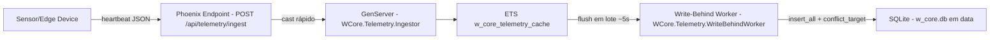

# Step 5 - Infra & Empacotamento (Docker + Release)

Preparação do sistema para execução no Edge: Elixir release + Docker multi-stage e persistência do SQLite em volume, mantendo o fluxo de eventos idempotente (upsert por `node_id`).

**Recursos:** `mix release.init`; `rel/env.sh.eex` com defaults (Edge/container); Docker multi-stage; `VOLUME /data`; `DATABASE_PATH` apontando para o arquivo do SQLite.

---

## Fluxo final (arquitetura)

---

## Docker + Release no Edge

1. **`rel/env.sh.eex`**
   - define defaults para o container:
     - `PHX_SERVER=true`
     - `DATABASE_PATH=/data/w_core.db`
     - `SECRET_KEY_BASE` (default para facilitar execução local)

2. **`Dockerfile` multi-stage**
   - estágio `build`: compila deps e gera a release
   - estágio `runtime`: roda somente o runtime necessário com `bin/w_core start`

3. **Persistência**
   - `VOLUME ["/data"]`
   - isso garante que `w_core.db` persista após reinícios do container.

---

## Trade-offs e resiliência

- hot-path escreve em **ETS** (evita lock/disco por evento).
- persistência é **eventual** e **idempotente** (upsert por `unique_index` em `node_id`).
- falha/restart do Ingestor não destrói a ETS (criada no boot da aplicação via `WCore.Application`).

---

## Arquivos principais

| Arquivo | Papel |
|----------|------|
| `Dockerfile` | build multi-stage + runtime enxuto |
| `rel/env.sh.eex` | defaults de runtime para Edge/container |
| `lib/w_core/telemetry/write_behind_worker.ex` | flush periódico e upsert |

---

## Explicação detalhada do código (Step 5)

### `Dockerfile` (multi-stage)
- **Stage build**:
  - instala toolchain de compilação;
  - baixa deps (`mix deps.get`) e compila (`mix compile`);
  - gera assets otimizados (`mix assets.deploy`);
  - monta release (`mix release --overwrite`).
- **Stage runtime**:
  - usa imagem menor, só com libs necessárias para executar release;
  - copia somente artefato final (`_build/prod/rel/w_core`);
  - expõe porta `4000` e sobe com `bin/w_core start`.
- Benefício: imagem final menor e mais segura (sem toolchain completa de build).

### `rel/env.sh.eex`
- Centraliza defaults de runtime para container/edge.
- Garante variáveis mínimas:
  - `PHX_SERVER=true` para subir endpoint HTTP no release;
  - `DATABASE_PATH=/data/w_core.db` para persistência em volume;
  - `SECRET_KEY_BASE` (deve ser forte em ambiente real).
- Evita bootstrap quebrado por variável ausente ao iniciar release.

### `docker-compose.yml` (operação local)
- Define serviço `w_core` com build local, `ports` e volume persistente.
- Injeta variáveis de ambiente de runtime de forma explícita.
- Facilita reproduzir ambiente próximo ao edge com um único comando.

### `scripts/docker_smoke_test.sh`
- Automatiza verificação básica de deploy:
  - build da imagem;
  - subida de container em porta livre;
  - teste das rotas de login/registro;
  - validação de redirect da rota protegida `/dashboard`.
- Serve como "gate" rápido para saber se release web está funcional.

---

## Decisões de operação para o avaliador

- **Compose com serviço principal**: um comando (`docker compose up --build`) para subir tudo.
- **Mailbox acessível no runtime local**: confirmação de conta sem depender de SMTP externo.
- **Load generator acoplado**: dashboard demonstra comportamento em tempo real sem setup manual extra.
- **URL local previsível**: links e navegação em `http://localhost:4000` para evitar ambiguidades.

---

## Possíveis melhorias e adaptações

- **Healthchecks explícitos**: adicionar probe HTTP para readiness/liveness no compose.
- **Perfil de segurança**: remover defaults de segredo em produção real e usar secret manager.
- **Observabilidade**: integração com OpenTelemetry + logs estruturados para diagnóstico edge.
- **Escalonamento horizontal**: adaptar para múltiplas instâncias com PubSub distribuído e estratégia de coordenação.
- **Build reprodutível**: pin de dependências e cache remoto para acelerar pipeline de release.

