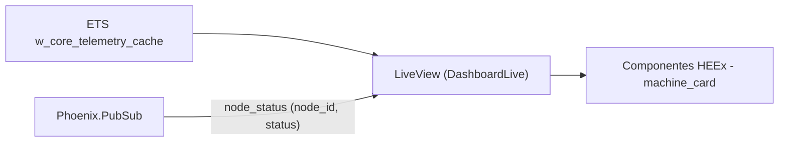

# Step 3 - LiveView Dashboard (Design System + PubSub Estratégico)

Dashboard em tempo real para operadores: leitura quente no ETS + updates incrementais via PubSub, com componentes HEEx semânticos.

**Recursos:** LiveView com snapshot inicial via ETS; PubSub incremental (`node_id + status`); atualização granular por máquina (evita re-render de toda lista); componentes HEEx para cards.

---

## Arquitetura do sistema

---

## O que foi implementado

1. **Componentes HEEx semânticos**
   - `WCoreWeb.IndustrialComponents.machine_card/1` renderiza:
     - `node_id`
     - `status`
     - `event_count`

2. **LiveView do dashboard**
   - `mount/3`:
     - subscreve no tópico do PubSub
     - carrega o snapshot inicial da ETS (rápido, sem DB)

3. **Atualização incremental**
   - O Ingestor publica `{:node_status, node_id, status}`.
   - O LiveView atualiza somente o card afetado:
     - usa `:ets.lookup/2` para obter o `event_count` mais recente
     - ajusta `assigns.machines` no `node_id` correspondente

4. **Rota protegida**
   - A rota `/dashboard` está sob `:require_authenticated_user`.

---

## Estado no LiveView vs estado no ETS

- **ETS** é a fonte de verdade quente:
  - agregações por `node_id`
  - contagem cumulativa
  - último status e último payload

- **LiveView** mantém apenas um cache de leitura:
  - `assigns.machines` (map por `node_id`)
  - `assigns.node_ids` para renderização estável

Isso evita que o dashboard dependa do tempo de resposta do SQLite para “piscar” em tempo real.

---

## Como evitamos over-rendering

- `node_ids` fica estável (a lista só muda quando surge um novo `node_id`).
- cards têm ids determinísticos no DOM (`machine-#{node_id}` no wrapper).
- o PubSub envia payload mínimo (sem payload completo).

---

## Arquivos principais

| Arquivo | Papel |
|----------|-------|
| `lib/w_core_web/live/dashboard_live.ex` | LiveView: snapshot inicial via ETS e atualização incremental via PubSub |
| `lib/w_core_web/components/industrial_components.ex` | Componentes HEEx: cards/labels sem dependências pesadas |

