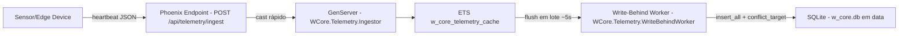

# Step 5 - Infra & Empacotamento (Docker + Release)

Preparação do sistema para execução no Edge: Elixir release + Docker multi-stage e persistência do SQLite em volume, mantendo o fluxo de eventos idempotente (upsert por `node_id`).

**Recursos:** `mix release.init`; `rel/env.sh.eex` com defaults (Edge/container); Docker multi-stage; `VOLUME /data`; `DATABASE_PATH` apontando para o arquivo do SQLite.

---

## Fluxo final (arquitetura)

---

## Docker + Release no Edge

1. **`rel/env.sh.eex`**
   - define defaults para o container:
     - `PHX_SERVER=true`
     - `DATABASE_PATH=/data/w_core.db`
     - `SECRET_KEY_BASE` (default para facilitar execução local)

2. **`Dockerfile` multi-stage**
   - estágio `build`: compila deps e gera a release
   - estágio `runtime`: roda somente o runtime necessário com `bin/w_core start`

3. **Persistência**
   - `VOLUME ["/data"]`
   - isso garante que `w_core.db` persista após reinícios do container.

---

## Trade-offs e resiliência

- hot-path escreve em **ETS** (evita lock/disco por evento).
- persistência é **eventual** e **idempotente** (upsert por `unique_index` em `node_id`).
- falha/restart do Ingestor não destrói a ETS (criada no boot da aplicação via `WCore.Application`).

---

## Arquivos principais

| Arquivo | Papel |
|----------|------|
| `Dockerfile` | build multi-stage + runtime enxuto |
| `rel/env.sh.eex` | defaults de runtime para Edge/container |
| `lib/w_core/telemetry/write_behind_worker.ex` | flush periódico e upsert |

